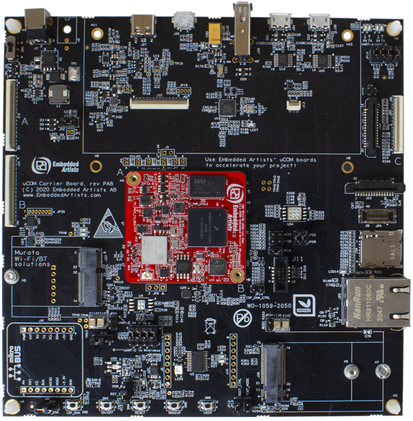

.. _ea_rt1170:

Embedded Artists iMX RT1176 Developer's Kit
###########################################

Overview
********

The iMX RT1176 Developer's Kit features the dual core i.MX RT1176 cross-over
microcontroller (MCU). The MCU has one Cortex-M7 core at 1 GHz and one Cortex-M4
core at 400 MHz. The i.MX RT1176 MCU is powerful and targets a wide range of
applications.

Hardware
********

iMX RT1176 uCOM board (Computer-on-module)
==========================================

- MIMXRT1176CVM8A MCU

  - 1GHz Cortex-M7 & 400Mhz Cortex-M4
  - 2MB SRAM with 512KB of TCM for Cortex-M7 and 256KB of TCM for Cortex-M4

- Memory

  - 256 Mbit SDRAM
  - 128 Mbit QSPI Flash

- Ethernet

  - 10/100/1000 Mbit/s on-board Ethernet PHY

iMX RT1176 Developer's Kit
==========================

- Ethernet

  - 10/100 Mbit/s Ethernet PHY (via adapter)

- USB

  - USB 2.0 OTG connector
  - USB 2.0 host connector

- Power

  - 12 V DC barrel jack

- Display

  - MIPI-DSI to HDMI adapter
  - MIPI-DSI

    + J19 connector Raspberry Pi 7-inch compatible
    + J20 connector RK055HDMIPI4M compatible

- Debug

  - JTAG 2x5-pos, 50 mil connector
  - MCU-Link debug adapter

- Sensor

  - MIPI-CSI serial camera connector

- Expansion port

  - Mikrobus/Click module interface
  - J15, 78-position 2 row, 50 mil

For more information, see these references:

- `iMX RT1176 Developer's Kit Website`_
- `iMX RT1176 uCOM board Website`_
- `iMX RT Getting started guide`_

Supported Features
==================

The iMX RT1176 Developer's Kit currently supports the following features.

+-----------+------------+-------------------------------------+
| Interface | Controller | Driver/Component                    |
+===========+============+=====================================+
| NVIC      | on-chip    | nested vector interrupt controller  |
+-----------+------------+-------------------------------------+
| SYSTICK   | on-chip    | systick                             |
+-----------+------------+-------------------------------------+
| GPIO      | on-chip    | gpio                                |
+-----------+------------+-------------------------------------+
| COUNTER   | on-chip    | gpt                                 |
+-----------+------------+-------------------------------------+
| TIMER     | on-chip    | gpt                                 |
+-----------+------------+-------------------------------------+
| CAN       | on-chip    | flexcan                             |
+-----------+------------+-------------------------------------+
| SPI       | on-chip    | spi                                 |
+-----------+------------+-------------------------------------+
| I2C       | on-chip    | i2c                                 |
+-----------+------------+-------------------------------------+
| PWM       | on-chip    | pwm                                 |
+-----------+------------+-------------------------------------+
| ADC       | on-chip    | adc                                 |
+-----------+------------+-------------------------------------+
| UART      | on-chip    | serial port-polling                 |
|           |            | serial port-interrupt               |
+-----------+------------+-------------------------------------+
| DMA       | on-chip    | dma                                 |
+-----------+------------+-------------------------------------+
| WATCHDOG  | on-chip    | watchdog                            |
+-----------+------------+-------------------------------------+
| ENET      | on-chip    | ethernet - 10/100M (via adapter)    |
+-----------+------------+-------------------------------------+
| USB       | on-chip    | USB Device                          |
+-----------+------------+-------------------------------------+
| HWINFO    | on-chip    | Unique device serial number         |
+-----------+------------+-------------------------------------+
| DISPLAY   | on-chip    | eLCDIF; MIPI-DSI. Tested with       |
+-----------+------------+-------------------------------------+
| FLEXSPI   | on-chip    | flash programming                   |
+-----------+------------+-------------------------------------+

The default configuration can be found in the defconfig files:
``boards/arm/ea_rt1170/ea_rt1176_kit_cm7_defconfig``
``boards/arm/ea_rt1170/ea_rt1176_kit_cm4_defconfig``

Dual Core samples
*****************

+-----------+------------------+----------------------------+
| Core      | Boot Address     | Comment                    |
+===========+==================+============================+
| Cortex M7 | 0x30000000[630K] | primary core               |
+-----------+------------------+----------------------------+
| Cortex M4 | 0x20020000[96k]  | boots from OCRAM           |
+-----------+------------------+----------------------------+

+----------+------------------+-----------------------+
| Memory   | Address[Size]    | Comment               |
+==========+==================+=======================+
| flexspi1 | 0x30000000[16M]  | Cortex M7 flash       |
+----------+------------------+-----------------------+
| sdram0   | 0x80030000[64M]  | Cortex M7 ram         |
+----------+------------------+-----------------------+
| ocram    | 0x20020000[512K] | Cortex M4 "flash"     |
+----------+------------------+-----------------------+
| sram1    | 0x20000000[128K] | Cortex M4 ram         |
+----------+------------------+-----------------------+
| ocram2   | 0x200C0000[512K] | Mailbox/shared memory |
+----------+------------------+-----------------------+

Only the first 16K of ocram2 has the correct MPU region attributes set to be
used as shared memory

Serial Port
===========

The MIMXRT1170 SoC has 12 UARTs. One is configured for the console.

Programming and Debugging
*************************

Build and flash applications as usual (see :ref:`build_an_application` and
:ref:`application_run` for more details).

Configuring a Debug Probe
=========================

A debug probe is used for both flashing and debugging the board. The Developer's
Kit comes with a MCU-Link Debug probe. This can be used with the LinkServer
runner, or can be reprogrammed with JLink firmware.

Using J-Link
------------

JLink is the default runner for this board.  Install the
:ref:`jlink-debug-host-tools` and make sure they are in your search path.

Using LinkServer
----------------

Known limitations with LinkServer and these boards include:
- ``west debug`` does not yet work correctly, and the application image is not
properly written to the memory.
- ``west flash`` will not write images to non-flash locations. The flash
command only works when all data in the image is written to flash memory
regions.

Install the :ref:`linkserver-debug-host-tools` and make sure they are in your
search path.  LinkServer works with the default CMSIS-DAP firmware included in
the MCU-Link debugger.

Use the ``-r linkserver`` option with West to use the LinkServer runner.

.. code-block:: console

   west flash -r linkserver

Configuring a Console
=====================

For Cortex-M7 examples, connect a USB cable from your PC to the USB micro-B
connector J29 on the carrier board. For Cortex-M4 examples, connect a USB
cable from your PC to the USB micro-B connector J30 on the carrier board.

Use the following settings with your serial terminal of choice (minicom, putty,
etc.):

- Speed: 115200
- Data: 8 bits
- Parity: None
- Stop bits: 1

Flashing
========

Here is an example for the :ref:`hello_world` application.

.. zephyr-app-commands::
   :zephyr-app: samples/hello_world
   :board: ea_rt1176_kit_cm7
   :goals: flash

When the board has been flashed you should see the following message in
the terminal. You can press the reset (SW4) button to restart the
application.

.. code-block:: console

   ***** Booting Zephyr OS v3.5.0-xxxx-xxxxxxxxxxxxx *****
   Hello World! ea_rt1176_kit_cm7

Debugging
=========

Here is an example for the :ref:`hello_world` application.

.. zephyr-app-commands::
   :zephyr-app: samples/hello_world
   :board: ea_rt1176_kit_cm7
   :goals: debug

Open a serial terminal, step through the application in your debugger, and you
should see the following message in the terminal:

.. code-block:: console

   ***** Booting Zephyr OS v3.5.0-xxxx-xxxxxxxxxxxxx *****
   Hello World! ea_rt1176_kit_cm7

.. _iMX RT1176 Developer's Kit Website:
   https://www.embeddedartists.com/products/imx-rt1176-developers-kit/

.. _iMX RT1176 uCOM board Website:
   https://www.embeddedartists.com/products/imx-rt1176-ucom/

.. _iMX RT Getting started guide:
   https://developer.embeddedartists.com/docs-mcu/imxrt-dev-guide/get-started/

